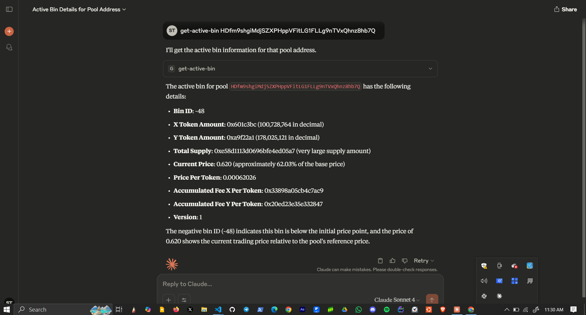

# Cuendillar

  

Cuendillar is an MCP server that builds upon Meteora's DLMM (Dynamic Liquid Market Maker) to provide a dynamic and sustainable liquidity layer for deFi on Solana.

## What is MCP

MCP is an open protocol that standardizes how applications provide context to LLMs. Think of MCP like a USB-C port for AI applications. Just as USB-C provides a standardized way to connect your devices to various peripherals and accessories, MCP provides a standardized way to connect AI models to different data sources and tools. To learn more about MCP check [here](https://modelcontextprotocol.io/introduction).

## What is Meteora's DLMM

Meteora's Dynamic Liquidity Market Maker (DLMM) gives LPs access to dynamic fees and precise liquidity concentration all in real-time.

Meteora's DLMM is designed with features that provide more flexibility for liquidity providers (LPs) and help LPs earn as much fees as possible with their capital.

DLMM was inspired by Trader Joe's Liquidity Book and in our implementation, we organize the liquidity of an asset pair into discrete price bins. Token reserves deposited in a liquidity bin are made available for exchange at the price defined for that particular bin. Swaps that happen within the price bin itself would not suffer from slippage. The market for the asset pair is established by aggregating all the discrete liquidity bins.

DLMM LPs earn fees for liquidity provision, dynamic fees during market volatility, and LM rewards where available. To learn more abot Meteora go [here](https://docs.meteora.ag/product-overview/meteora-liquidity-pools/dlmm-overview/what-is-dlmm)

## Prerequisites

- Node.js (v16 or higher recommended)
- npm package manager
- A Solana wallet from Phantom

## Installation

```bash
git clone https://github.com/stdthoth/cuendillar
cd cuendillar
npm install
npm run build
```

Create a `.env` file in the root directory resembling this one below

```text
    USER_PRIVATE_KEY="xxxxxxxxxxxxxxxxxxxxxxxxxxxxxxxxxx" #base58 encoded private key 
    RPC="https://api.devnet.solana.com"
```

## Basic Usage

This section explains how to use the Solana MCP server in Claude Desktop.

### Configuration file

This is the configuration with which claude can connect to the MCP server.

```json
{
  "mcpServers": {
    "cuendillar": {
      "command": "node",
      "args": ["<full-path-to-repo>/dist/index.js"],
      "env":{
          "USER_PRIVATE_KEY":"YOUR_PRIVATE_KEY", 
    "RPC":"https://api.devnet.solana.com"
          }
    }
  }
}
```

### Getting a pool address

You can get the address of an LP by going to the official meteora app [here](https://app.meteora.ag)

### ⚠️ Warning

For the purpose of testing, use of the Solana devnet is highly advised to avoid loss of funds. You can get devnet Solana tokens from [here](https://faucet.solana.com/)

## Tools

The following are the tools currently available to Cuendillar.

### Get Active Bin

- `get-active-bin`: To get the active bin where the current
pool price resides



#### Creating a New Liquidity Position

When creating a new liquidity position, there are a few different liquidity position scenarios to consider.

You can create a Balance Position, Imbalance Position, or One-Sided Position

For `StrategyType:` you can select `StrategyType.Spot`, `StrategyType.BidAsk`, or `StrategyType.Curve`

- `balance-deposit-position`: This creates a new liquidity position. . This functions like enabling "Auto-Fill" on the user interface, which automatically calculates the required amount of Token Y to match the equivalent value of Token X when creating a position.
- `imbalance-deposit-position`: To create a new liquidity position with an Imbalance Position. This is similar to disabling "Auto-Fill" on the user interface, which allows users to manually specify the amount to be added for token X and token Y without maintaining an equal value balance between both assets.
- `create-one-side-position`:To create a new one-sided/single-sided liquidity position with only one token added; typically used to DCA (dollar cost average) into or out of a position.
- `get-position-state`: Get the state of the position opened by the user.

#### Adding Liquidity to an existing position

- `add-liquidity-to-existing-position`: To add liquidity to an existing liquidity position

#### Removing Liquidity from an existing position

- `remove-liquidity`: To remove liquidity from an existing liquidity position

#### Swap

- `swap`: To swap tokens within the specified liquidity pool.
